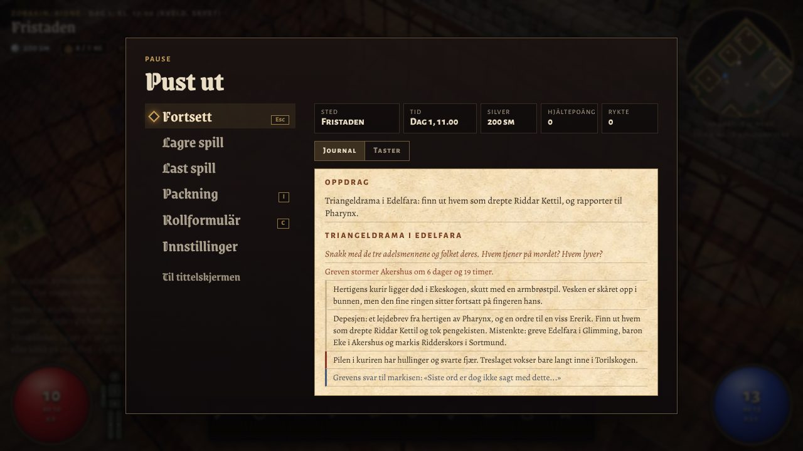

# Menyer og brukerflate, 0.6

Claude på `claude/menyer`, 2026-10-08. Grenen bygger på `chatgpt/teksturer` (PR #5), som bygger på `claude/edelfara` (PR #4).

## Hva som er endret

- **Pausemenyen** har handlingene i en loddrett liste til venstre, i samme skrift som tittelmenyen: Fortsett, Lagre spill, Last spill, Packning, Rollformulär, Innstillinger og Til tittelskjermen. Til høyre står løpet i korte trekk (sted, tid, silver, hjältepoäng, og rykte i byen eller nivå i kloakken) og to faner: Journal og Taster. Tastene viser berøringsknappene på mobil.
- **Til tittelskjermen** spør først. Første trykk viser at det som ikke er lagret, går tapt. Autolagringen blir liggende.
- **Innstillinger i spillet.** Samme rader som i tittelen flyttes inn i et eget vindu fra pausemenyen og tilbake igjen. Nye valg: Lyd på eller av, Uskarpe kanter (tilt-shift) og Tekst (Normal, Stor, Størst). Tekststørrelsen gjelder loggen, samtalene, journalen og hjelpen.
- **Samtaler:** tallene 1 til 9 velger et ord når skrivefeltet er tomt, og et lite tall står foran hvert ord på PC.
- **Journalen** viser ikke lenger hvilke ledetråder som er villspor før saken er rapportert i Pharynx.
- **Loggen** nede til venstre har en mørk stripe bak hver linje, så den kan leses over lys brostein.
- **Slik spiller du** er delt i Taster (eller Berøring på mobil), I byen og på reise, og Reglene. Panelet ruller inni seg, så Tilbake alltid er synlig.
- **Rollformuläret** har Lukk øverst som følger med når du ruller, undertittelen står i brødtekst, og verdiene brytes på smal skjerm.
- **Skapingen** har alle ti stegene på én rad.
- **Last spill:** tomme plasser er bare en linje.
- **Startbildet** sier «Trykk på skjermen» på mobil. Karthintet nevner Esc og I.

## Feil som er rettet

- Paneler gikk utenfor skjermen på mobil, fordi bredden ble regnet uten polstringen. Panelene, inputfeltene og lagringsradene bruker nå `box-sizing: border-box`.
- Knapper arvet ikke skriften. Gavekortene i trappa og kortene i skapingen sto i systemskriften. Nå arver `button`, `select` og `input` skriften fra omgivelsene.
- Undertittelen i rollformuläret brukte `.sub` fra tittelskjermen og ble stor og gotisk.

## Bilder

| | |
| --- | --- |
| Pause før | [for-pause.jpg](menyer/for-pause.jpg) |
| Pause etter, med journal | [etter-pause.jpg](menyer/etter-pause.jpg) |
| Innstillinger i spillet | [etter-innstillinger.jpg](menyer/etter-innstillinger.jpg) |
| Skapingen | [etter-skaping.jpg](menyer/etter-skaping.jpg) |
| Mobil: rollpersoner og pause, før og etter | [mobil-for-etter.jpg](menyer/mobil-for-etter.jpg) |

## Tester

Lokalt med Chromium 1194 og SwiftShader: fire kampeffekt-tester, combatfx-browser mot dist/combatfx-test og dist/pages-test (med stress('tjuv', 20) gjennom fem nivåer), texture-fallback og texture-browser. Ingen feil i konsollen. Escape fra innstillingene går tilbake til pausen, og radene står i tittelens panel igjen etterpå.
