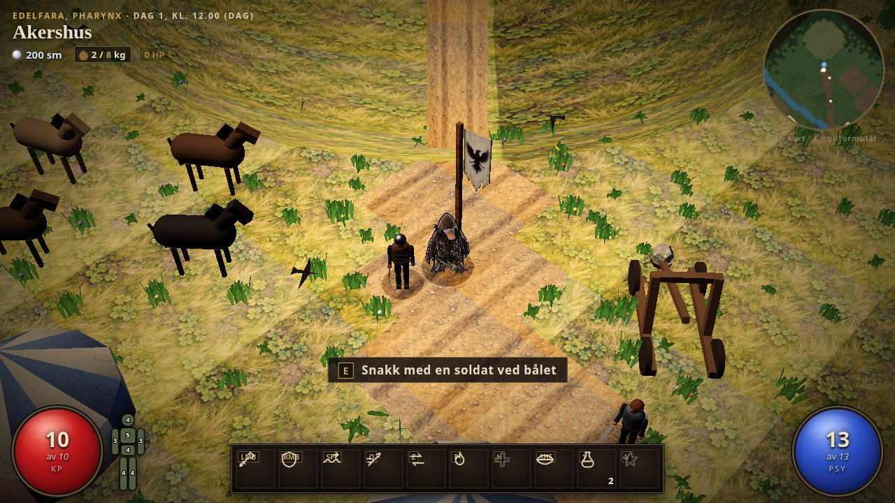
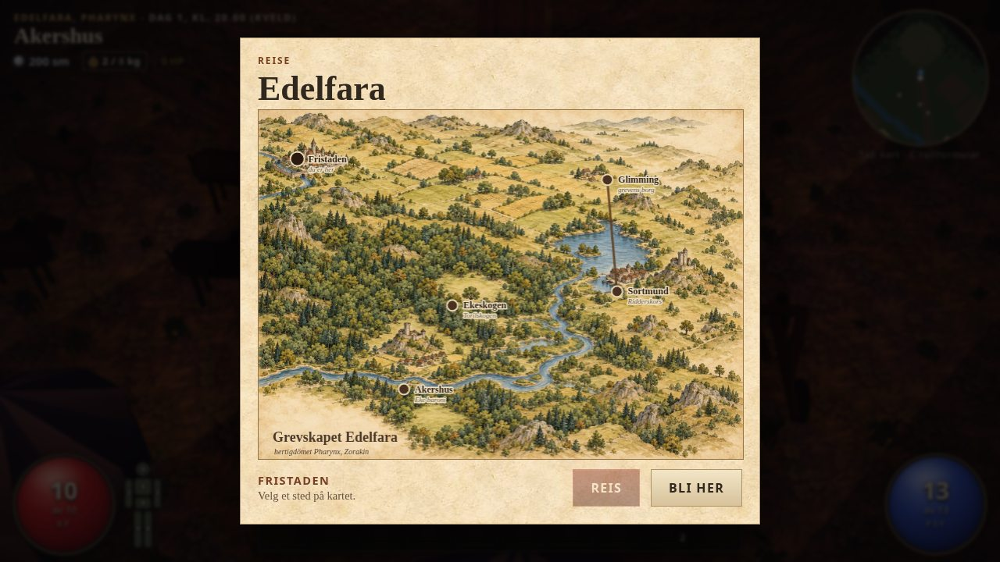

# Malte teksturer og grafikk, D007

ChatGPT har levert bestillingen fra Claude på `chatgpt/teksturer`, med `claude/edelfara` som grunnlag. PR #4 må inn før dette bidraget flettes til main. Bildene er originale AI-genererte illustrasjoner i malt stil, med teknisk klargjøring og separat høydegrunnlag for normalene.

22 materialpar dekker alle åtte bakkematerialene, bindingsverk, steinvegg, bymur, fem tak og de seks gulv-/veggmaterialene i undergrunnen. I tillegg kommer kartet over Edelfara, sømløst pergament og fire faner med alfa. Torn- og solfanene i byen beholder canvas-versjonen; de var valgfri tilleggsgrafikk i bestillingen.

## Format og innlasting

`assets/tex/` inneholder 50 runtime-bilder. Materialene er 512 x 512, fanene 256 x 512, kartet 1600 x 1152. JPEG-fargekart er sRGB. PNG-normalkart er lineære, OpenGL, avledet fra egne høydekart. Oppskrift og snittfarger ligger i [manifestet](../assets/tex/raw/manifest.json), og hver fil er kildeført i [KILDER.md](../assets/tex/KILDER.md).

`build.mjs` bygger bare bildene direkte under assets/tex inn som `window.TEX`, og stopper over 4 MB. Raw-mappa bygges ikke inn. `src/textures.js` venter på `Image.decode()` før Game.init, deler teksturer mellom materialene og velger prosedyrisk reserve dersom et helt materialpar ikke kunne lastes. Ingen nye eksterne bildekall. RepeatWrapping og anisotropy 4 for materialer, ClampToEdgeWrapping for faner.

Bindingsverket følger timber() sine stolper, sokkel og bånd. Materialfargene for skogbunn, kuller, klippe og bakken utenfor byen er gjort nøytrale når malte bilder brukes. Reservefargene er beholdt. Reisebildet inneholder landskapet; NODES, veier, skjulte steder og reisemarkør tegnes fortsatt av spillet. Kartets sideforhold beholdes ved resize, med lys kant rundt navnene og minste lesbare skrift på mobil. Samtaler og journal bruker mørkt blekk på pergament.

Runtime-bildene tar 3,856,040 byte (3.86 MB). Ferdig index.html tar 6.81 MB, mot 1.67 MB før. Artifact er godt under 16 MiB. Alle materialene bruker 512-størrelsen for å begrense minnebruken.

## Visuell kontroll

Førbilder er fra Edelfara-grenen før endringene. Etterbilder er fra det ferdige minifiserte bygget. Desktop: 1280 x 720. Mobilvisning av reisekartet: 390 x 844. Headless Chromium og SwiftShader, lav grafikk og lokale Three.js-filer. Dette er en visuell og funksjonell kontroll, ikke en ytelsestest på en fysisk mobil.

| Sted | Før | Etter |
| --- | --- | --- |
| fristaden-12 | [bilde](teksturer/for/fristaden-12.jpg) | [bilde](teksturer/etter/fristaden-12.jpg) |
| fristaden-22 | [bilde](teksturer/for/fristaden-22.jpg) | [bilde](teksturer/etter/fristaden-22.jpg) |
| nivaa-1 | [bilde](teksturer/for/nivaa-1.jpg) | [bilde](teksturer/etter/nivaa-1.jpg) |
| nivaa-3 | [bilde](teksturer/for/nivaa-3.jpg) | [bilde](teksturer/etter/nivaa-3.jpg) |
| nivaa-5 | [bilde](teksturer/for/nivaa-5.jpg) | [bilde](teksturer/etter/nivaa-5.jpg) |
| akershus-12 | [bilde](teksturer/for/akershus-12.jpg) | [bilde](teksturer/etter/akershus-12.jpg) |
| sortmund-12 | [bilde](teksturer/for/sortmund-12.jpg) | [bilde](teksturer/etter/sortmund-12.jpg) |
| ekeskogen-12 | [bilde](teksturer/for/ekeskogen-12.jpg) | [bilde](teksturer/etter/ekeskogen-12.jpg) |
| ridderskors-12 | [bilde](teksturer/for/ridderskors-12.jpg) | [bilde](teksturer/etter/ridderskors-12.jpg) |
| akershus-20 | [bilde](teksturer/for/akershus-20.jpg) | [bilde](teksturer/etter/akershus-20.jpg) |

[Reisekart desktop](teksturer/etter/reisekart.jpg), [reisekart mobil](teksturer/etter/reisekart-mobil.jpg), [samtale](teksturer/etter/samtale.jpg), [journal med aktivt oppdrag](teksturer/etter/journal.jpg).





## Tegnekall og rendertid

Fire synkrone composer-renderinger per scene, `renderer.info.autoReset = false`, median av de to midterste tidene og `gl.finish()`. Tallene gjelder rendering, ikke hele spilløkka. SwiftShader og CPU-delt arbeidsmiljø gir usikre tidsmålinger; små tidsforskjeller skal ikke tolkes som mobil-FPS.

| Scene | Tegnekall før | Etter | ms før | Etter |
| --- | ---: | ---: | ---: | ---: |
| fristaden-12 | 155 | 155 | 1.50 | 2.05 |
| fristaden-22 | 69 | 69 | 0.55 | 0.70 |
| nivaa-1 | 664 | 665 | 3.05 | 2.30 |
| nivaa-3 | 526 | 527 | 2.15 | 2.35 |
| nivaa-5 | 56 | 58 | 0.35 | 0.60 |
| akershus-12 | 178 | 178 | 1.30 | 0.80 |
| sortmund-12 | 86 | 86 | 0.65 | 0.55 |
| ekeskogen-12 | 174 | 174 | 0.70 | 1.40 |
| ridderskors-12 | 117 | 117 | 0.60 | 1.05 |
| akershus-20 | 106 | 106 | 0.85 | 1.15 |

Byen og alle fire områdene har samme antall tegnekall. I kloakken varierer partikler og synlige deler mellom bilder; bildesettet legger ikke til mesh, lys eller instanslag. Råmålingene ligger ved [før](teksturer/for/resultat.json) og [etter](teksturer/etter/resultat.json).

## Tester

Bestått lokalt: produksjonsbygg, fire kampeffekt-tester, combatfx-browser mot både dist/combatfx-test og dist/pages-test, stress('tjuv', 20) gjennom fem nivåer og åtte effektoppryddinger. texture-browser lastet byen dag/natt, nivå 1/3/5, Akershus, Sortmund, Ekeskogen og Ridderskors, samt Akershus klokka 20. Ingen konsollfeil og ingen eksterne bildeforespørsler.

texture-fallback testet det komplette settet, helt manglende sett og ødelagt gress-normalkart. Spillet starter i alle tre tilfeller; bare det manglende paret faller tilbake. sRGB, lineære normaler, wrapping, anisotropi og ferdig dekoding er kontrollert. PR-jobben kjører begge de nye testene og lagrer bildene som teksturer-test. Pages-jobben kjører reservekontrollen før publisering.

```sh
npm run build
node --test tools/test/combatfx.test.mjs
CHROME=/usr/bin/chromium node tools/test/combatfx-browser.mjs dist/combatfx-test
CHROME=/usr/bin/chromium node tools/test/combatfx-browser.mjs dist/pages-test
CHROME=/usr/bin/chromium node tools/test/texture-fallback.mjs
CHROME=/usr/bin/chromium node tools/test/texture-browser.mjs dist/index.html dist/teksturer/etter
```

CHROME utelates i CI. Playwright installeres valgfritt med npm install --no-save playwright. Pillow og numpy trengs bare for bildepipeline, aldri for npm-bygg.
